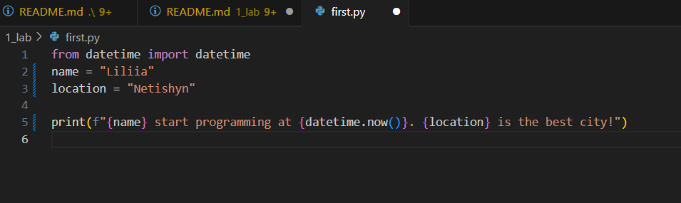

# repository

## Звіт до роботи
## Тема: Вступні заняття: налаштування середовища, прочаток роботи з Python та Markdown;


## Мета роботи: Вступні заняття: налаштування середовища, прочаток роботи з Python та Markdown;

## завдання 1 створення нового репозиторію на github;

Створили програму на python
Програма вивела значення 

```python

Liliia start programming at 2025-09-21 20:45:32.456789. Netishyn is the best city!

```

Навчились робити прості коди на Python та публікувати їх на github

вставлені рисунки 




вставлений код:

```python

from datetime import datetime
name = "Liliia"
location = "Netishyn"

print(f"{name} start programming at {datetime.now()}. {location} is the best city!")

```


Висновок:

❓ **Що зроблено в роботі:**  
  Створено програму на Python, яка виводить ім’я, місто та поточний час.

- ❓ **Чи досягнуто мети роботи:**  
  Так, мета роботи досягнута

❓ Які нові знання отримано;
Я згадала як працювати з github

❓ Чи вдалось відповісти на всі питання задані в ході роботи;
ChatGPT is the best assistant.

❓ Чи вдалося виконати всі завдання;
Наче так, але на оформленні звіту я вже конкретно втомилась і писала на швидку руку

❓ Чи виникли складності у виконанні завдання;
Дуже складно було розібратися з тим, як зберегти зміни в репозиторії і опублікувати на GitHub, через постійні помилки, які я не могл авиправити. 

❓ Чи подобається такий формат здачі роботи (Feedback);
Мені справді сподобався такий формат здачі робіт. Два тижні була впевнена що дуже складні завдання, але коли сіла за робту, то виявтлось просто і цікаво 
